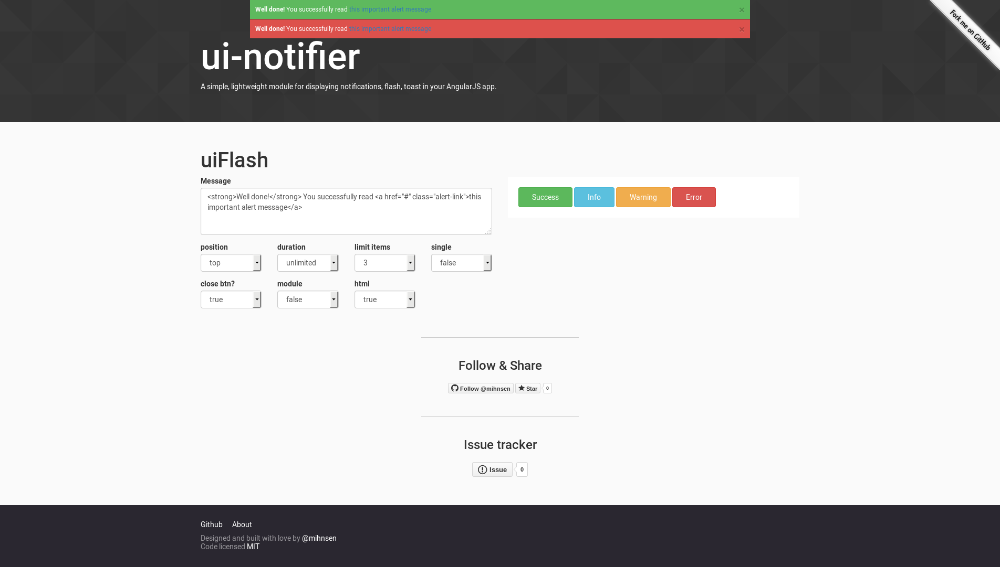

ui-carousel ([live demo](http://mihnsen.github.io/ui-carousel/)) [](https://travis-ci.org/mihnsen/ui-carousel) [](https://codeclimate.com/github/mihnsen/ui-carousel)
=========

A simple, lightweight module for carousel in your AngularJS app, Inspired from [http://kenwheeler.github.io/slick/](http://kenwheeler.github.io/slick/). No Jquery required
.

[](http://mihnsen.github.io/ui-carousel)

IE10+ (AngularJS v1.3.x no longer supports IE8) and the latest versions of Chrome, FireFox and Safari have been tested and are supported.  If you do run across any issues, please submit a [new issue](https://github.com/mihnsen/ui-carousel/issues) and I'll take a look - or better yet - submit a PR with the bug fix and I'll merge it in.

You can check out the vitals and demo here: [http://mihnsen.github.io/ui-carousel](http://mihnsen.github.io/ui-carousel)

#### First version
With first version, we provide a directive ui-carousel. Basic support like slick carousel
- arrows
- autoplay
- autoplaySpeed
- cssEase
- dots
- fade
- infinite
- initialSlide
- slidesToShow
- slidesToScroll
- speed
- onBeforeChange
- onAfterChange
- onInit

[](http://mihnsen.github.io/ui-carousel)

#### Comming soon
With next version we will provide:

- Lazy loading
- Filtering
- Vertical


Implementation
==============

### Requirements

AngularJS is the only dependency.  Animation is achieved with pure JS, jQuery not necessary.

### Installation

You can install ui-carousel with Bower.

    bower install angular-ui-carousel --save

You can also install ui-carousel with npm.

    npm install angular-ui-carousel --save


And as always, you can download the source files straight from this repo - they're located in the `dist` dir.  Be sure to include the minified version of both js and css files.

### Usage
Directive configuration.

```javascript
<ui-carousel 
  slides="ctrl.autoplay.slides"
  slides-to-show="3"
  slides-to-scroll="1"
  initial-slide="1"
  autoplay="true"
  autoplay-speed="2000"
  dots="true">

  <carousel-item>
    <h3>{{ item + 1 }}</h3>
  </carousel-item>
</ui-carousel>
```


Definitions
===========

### Events

#### onInit()
On carousel initialized

#### onBeforeChange(currentSlide, nextSlide)
Fires before slide change

#### onAfterChange(currentSlide)
Fires after slide change


Development
===========

If you've forked or cloned the project and would like to make any sort of adjustments, there are few items to make note of.  First, your system will need to have the following bits in place:

- Node & NPM
- gulp
- karma
- Scss

Second, there are a few gulp tasks that you'll be able to leverage to help validate and prepare your changes for use.

You can fire off a `gulp` or `gulp build` command manually at any time to lint, minify, and setup your demo (built in the _gh-pages dir) for testing.

```console
gulp (or gulp build)
```

Also, you can run `gulp dev` to lint, minify, and prep your demo for testing.  Once the build is complete, it'll also fire off a `watch` so that any changes that are made to the the sass, js, and demo files will automatically trigger the build script to update your project.

```console
gulp
```

To run through the configured unit tests, you can run `gulp test`.  This will fire off a series of tests that check that all default options are set correctly, all configurable options are able to be set correctly, and that all methods carry out the functionality that they're supposed to.  These tests should let you know if any of the updates that you've made have negatively effected any preexisting functionality.  Also, when the tests complete, there will be a test coverage report generated and stored in the `coverage` directory.

```console
gulp test
```

To public gh-pages you can using command bellow. A folder with name _gh-pages contain all file in your gh-pages repo will be generated.
Read here to config your gh-pages: 
- https://help.github.com/articles/creating-project-pages-from-the-command-line/
- https://help.github.com/articles/configuring-a-publishing-source-for-github-pages/
```console
gulp gh-pages
```

Next, you'll want to do all of your development within three locations.  If you add changes anywhere else, they're likely to be overwritten during the build process.  These locations are:

`src/ui-carousel/*.js` - for any script modifications.

`src/ui-carousel/scss/*.scss` - for any style modifications.

`src/demo/*` - for any modifications to the demo.

Lastly, once you've made your changes and run through the appropriate gulp tasks, your changes should be baked and ready for you to consume - located in the `dist` directory as minified js and css files.


## Authors
**Minh Nguyen**

+ [https://twitter.com/mihnsen](https://twitter.com/mihnsen)

## Credits
Inspired by http://kenwheeler.github.io/slick/

## Copyright
Copyright © 2016

## License
ui.carousel is under MIT license - http://www.opensource.org/licenses/mit-license.php
